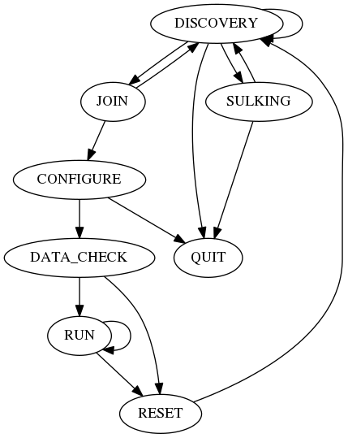

#Implementation specification on CAPWAP(RFC5415) for coordinate multiple WTPs by liteon

##Revision
|Author | Date | Comments|
|:-|:-|:-|
|Frank Zhou | May 31, 2017 | Draft|

[TOC]


##Introduction

###Abstract

This specification defines the how liteon implements RFC5415 on Control And Provisioning of Wireless Access Points (CAPWAP) Protocol. For the detail of CAPWAP, please refers to [RFC5415](https://tools.ietf.org/rfc/rfc5415.txt), [RFC4564](https://tools.ietf.org/rfc/rfc4564.txt)


###Background

The story about using CAPWAP is based on the need to coordinate multiple APs on radio settings for maximize wireless connectivity, wireless throughput and optimize coverage. Wireless related statistic and configuration is important part of this goal.

The CAPWAP protocol supports two modes of operation: Split and Local MAC (medium access control).  In Split MAC mode, all L2 wireless data and management frames are encapsulated via the CAPWAP protocol and exchanged between the AC and the WTP. Here we only refers to local MAC

Another essential fact is that we don't need WTP/AC to forward 802.11/802.3 packet cause the product is totally self-managed without central AC. We use AC here only to collect self defined statistic result and dispatch different settings after analyse the whole wireless network environment.

###Terminology

** Access Controller (AC)**: A server collect all WTPs statistics and dispatch different radio settings according to the wireless statistic collected from WTPs. AC is not constrained to be a server, it can be a utility running on an embedded WTP. An important prerequisite is AC must be TCP/IP Layer III accessible. So when implements AC on network device, such as WTP itself, relevant restart process is an indispensable part after WTP renew a difference IP address.

** Wireless Termination Point(WTP) **: Here we only refers to Fat AP which provides fully radio setting and access function and can be configurated without any server.
WTP don't need to forward its wireless packet to a central server, they just forward RF statistic information to AC so that AC decide how to optimize RF settings for multiple WTPs work together
Multiple WTPs communicate to a central AC via Internet Protocol(IP).

### Objectives

According to [RFC4564](https://tools.ietf.org/rfc/rfc4564.txt), we choose CAPWAP mainly for the following objectives.

1. Monitoring and Exchange of System-wide Resource State (5.1.6 on RFC4564)
2. CAPWAP Protocol Security (5.1.8 on RFC4564)
3. NAT Traversal (5.1.15 on RFC4564)

We choose CAPWAP NOT for

1. Firmware Trigger (5.1.5 on RFC4564)

##Protocol Overview

###Overview

1. CAPWAP is based on UDP. BTW, IPv6 implementation is excluded.
   All packets follow [Ethernet Header] + [IPv4 Header] + [UDP Header] + [CAPWAP Header] + [optional DTLS Header]

2. There are 2 channel concept, one for control (AC's default port 5246) another for data(AC's default port is 5247).
**Control channel** is a bi-directional flow defined by the AC IP Address, WTP IP Address, AC control port (default 5246), WTP control port(we use 12225), and the transport-layer protocol (UDP or UDP-Lite) over which CAPWAP control packets are sent and received. **CAPWAP Control** messages are management messages exchanged between a WTP and an AC.
**Data channel** is a bi-directional flow defined by the AC IP Address, WTP IP Address, AC data port (default 5247), WTP data port(we use 12226), and the transport-layer protocol (UDP or UDP-Lite) over which CAPWAP data packets are sent and received.
Both of the channel implements keep-alive request/response. **CAPWAP Data** message encapsulate forwarded wireless frames.
Data channel is mainly for forwarding wireless 802.11 or wired 802.3 packets and optional.For our fat AP use case we WILL NOT implements data channel except its basic keep alive needs.

3. CAPWAP Control message and optionally CAPWAP Data messages are secured using Datagram Transport Layer Security(DTLS)[[RFC4347](https://tools.ietf.org/rfc/rfc4347.txt)], except for Discovery Request/Reponse message.

4. Both data and control packets can exceed the Maximum Transmission Unit (MTU) length, the payload of a CAPWAP Data or Control message can be fragmented.

5. CAPWAP provides a keep-alive feature that preserves the communication channel(both data and control) between the WTP and AC. If the AC fails to appear alive, the WTP will try to discover a new AC.

###CAPWAP Session Establishment Overview
Please refers 2.2 in [RFC5415](https://tools.ietf.org/rfc/rfc5415.txt) for detail information.
We show the original diagram directly as below. As the following section on liteon's implementation on state machine is consistent with the session extablishment chart.
```
           ============                         ============
               WTP                                   AC
           ============                         ============
            [----------- begin optional discovery ------------]
                           Discover Request
                 ------------------------------------>
                           Discover Response
                 <------------------------------------
            [----------- end optional discovery ------------]

                      (-- begin DTLS handshake --)

                             ClientHello
                 ------------------------------------>
                      HelloVerifyRequest (with cookie)
                 <------------------------------------


                        ClientHello (with cookie)
                 ------------------------------------>
                                ServerHello,
                                Certificate,
                                ServerHelloDone*
                 <------------------------------------

                (-- WTP callout for AC authorization --)

                        Certificate (optional),
                         ClientKeyExchange,
                     CertificateVerify (optional),
                         ChangeCipherSpec,
                             Finished*
                 ------------------------------------>

                (-- AC callout for WTP authorization --)

                         ChangeCipherSpec,
                             Finished*
                 <------------------------------------

                (-- DTLS session is established now --)

                              Join Request
                 ------------------------------------>
                              Join Response
                 <------------------------------------
                      [-- Join State Complete --]

                   (-- assume image is up to date --)

                      Configuration Status Request
                 ------------------------------------>
                      Configuration Status Response
                 <------------------------------------
                    [-- Configure State Complete --]

                       Change State Event Request
                 ------------------------------------>
                       Change State Event Response
                 <------------------------------------
                   [-- Data Check State Complete --]


                        (-- enter RUN state --)

                                   :
                                   :

                              Echo Request
                 ------------------------------------>
                             Echo Response
                 <------------------------------------

                                   :
                                   :

                              Event Request
                 ------------------------------------>
                             Event Response
                 <------------------------------------

                                   :
                                   :

```

###Liteon CAPWAP State Machine Definition

Please refers 2.3 in [RFC5415](https://tools.ietf.org/rfc/rfc5415.txt) for the official state machine chart.

Our implementation on CAPWAP reduce to following diag(From the view of WTP).


* DISCOVERY -> DISCOVERY
This happens if we send out DISCOVERY REQUEST but not receive any DISCOVERY RESPONSE.

* DISCOVERY -> SULKING
After sending out DISCOVERY REQUEST but no DISCOVERY RESPONSE received at maxDiscoveies times, WTP go into SULKING state.

* DISCOVERY -> JOIN
After sending out DISCOVERY REQUEST and got DISCOVERY RESPONSE from AC, WTP pick up an AC(One algorithm is pick the AC with less WTP communicating with it.) as its destination.
If the addresses returned by the AC in the DISCOVERY RESPONSE don't include the address of the sender of DISCOVERY RESPONSE, we ignore the address in the DISCOVERY RESPONSE and use the one of the sender(maybe the AC sees gargage address, i.e. it is behind a NAT).
If DTLS is enabled on compile MACRO, we will setup DTLS prerequisite handshake/certificate/keyexchange first.


* DISCOVERY -> QUIT
If WTP can't init/setup its socket or other necessary parameter.

* SULKING -> DISCOVERY
After silent interval expired, WTP go into DISCOVERY state and restart to send out DISCOVERY REQUEST again.
The silent period in SULKING state is on the perpose to minimize possibility for Denial-of-Service(DoS) attack.

* SULKING -> QUIT
If there's something to read during silent sulking period, we will read and discard it and QUIT.

* JOIN -> DISCOVERY
If we
1) fail on init a wait JOIN timer;
2) fail on bind local WTP config port(12225);
3) fail on bind local WTP data port(12226);
4) fail on DTLS setup;
5) error creating WTP Config Channel receive thread;
6) error creating WTP Data Channel receive thread;
7) error init DTLS session client;
8) error happens on sending out JOIN REQUEST after DTLS session established;
9) without receiving any JOIN RESPONSE;
we will go back into DISCOVERY state again.

* JOIN -> CONFIGURE
If we got JOIN RESPONSE after sending out JOIN REQUEST.

* CONFIGURE -> DATA_CHECK
If we got CONFIGURE RESPONSE after sending out CONFIGURE REQUEST.

* CONFIGURE -> QUIT
If we
1) error happens sending out CONFIGURE REQUEST;
2) without receiving any CONFIGURE RESPONSE;
we will QUIT.

* DATA_CHECK -> RESET
If we
1) failure assembling keepalive request;
2) failure sending KeepAlive request;
3) failure receiving on DTLS Data channel after sending out KeepAlive
we will go into RESET state.

* DATA_CHECK -> RUN
If we got keepalive response on data channel(no matter DTLS is compiled ON or OFF)

* RUN -> RUN
This is the normal state of operation.

* RUN -> RESET
If we
1) error starting thread that receive DTLS DATA packet;
2) error starting echo request timer;
3) data channel is dead;
4) Max num of retransmit echo request reached, we consider peer dead;
5) faiilure receiving response after sending out something;
6) received something different from a valid run message;
7) critical error managing generic run message;
we should go int RESET state.

* RESET -> DISCOVERY
Do necessary cleanup work and go into DISCOVERY state again.

###DTLS related topic

* Section 2.4.4 on [RFC5415](https://tools.ietf.org/rfc/rfc5415.txt) cite that 'DTLS supports endpoint authentication with certificates or pre-shared keys.'

* We use openssl 0.9.8a or later.

* Our implementation only support certificates, cause openssl privatesharedkey (PSK) implementation doesn't support CAPWAP's cipher.

* About cipher list on using certificate, CAPWAP says that 
TLS_RSA_WITH_AES_128_CBC_SHA MUST be supported, and TLS_DHE_RSA_WITH_AES_128_CBC_SHA SHOULD be supported.
Openssl support both of cipher alogrithum above. In coding the cipher list is configured as  `SSL_CTX_set_cipher_list((*ctxPtr), "AES128-SHA:DH-RSA-AES128-SHA");`

##Transport

* We only consider IPv4 network. Chapter 3 on [RFC5415](https://tools.ietf.org/rfc/rfc5415.txt) cite that 'When run over IPv4, UDP is used for the CAPWAP Control and Data channels'.

### UDP Transport

* Chapter 3.1 on [RFC5415](https://tools.ietf.org/rfc/rfc5415.txt) cite that 'When CAPWAP is run over IPv4, the UDP checksum field in CAPWAP packets MUST be set to zero'.

* The CAPWAP control port at the AC is the well-known UDP port 5246.  The CAPWAP control port at the WTP can be any port selected by the WTP.

* The CAPWAP data port at the AC is the well-known UDP port 5247.  The CAPWAP data port at the WTP can be any port selected by the WTP.

* If an AC permits the administrator to change the CAPWAP control port, the CAPWAP data port MUST be the next consecutive port number.(that means if control port on AC is N, then data port on AC MUST be N+1) In our environment we will use the default port 5246 & 5247. So this rule can be ignored.

### AC Discovery

* Discovery state/phase is optional. WTP does not need to complete the AC Discovery phase if it uses a pre-configured AC.

* A WTP and an AC will frequently not reside in the same IP subnet(broadcast domain).  When this occurs, the WTP must be capable of discovering the AC, without requiring that multicast services are enabled in the network.

*  When the WTP attempts to establish communication with an AC, it sends the Discovery Request message and receives the Discovery Response message from the AC(s).

*  The WTP MUST send the Discovery Request message to either the limited broadcast IP address (255.255.255.255), the well-known CAPWAP multicast address (224.0.1.140), or to the unicast IP address of the AC.

*  Upon receipt of the Discovery Request message, the AC sends a Discovery Response message to the unicast IP address of the WTP, regardless of whether the Discovery Request message was sent as a broadcast, multicast, or unicast message.

* When a WTP transmits a Discovery Request message to a unicast address it means WTP must first obtain the IP address of the AC. It MAY be static configured on the WTP non-volatile storage or by DHCP([RFC5417](https://tools.ietf.org/rfc/rfc5417.txt)) or DNS([RFC2782](https://tools.ietf.org/rfc/rfc2782.txt)).

* AC may include AC IPv4 List element in Discovery Response to help WTP discover additional ACs.(IPv6 List is not discussed here)

* Once the WTP has received Discovery Response messages from the candidate ACs, it MAY use other factors to determin the preferred AC. Supported bindings will be ignored cause we only talk about fat AP here. We will implement WTP to choose the AC which has less WTP connnected as the preferred one.

##Packet Formats

### Control Packet without DTLS Security protected (Discovery Req/Resp)

The CAPWAP Control protocol includes two messages that are never protected by DTLS: the Discovery Request message and the Discovery Response message.  These messages need to be in the clear to allow the CAPWAP protocol to properly identify and process them.  The format of these packets are as follows:
```
       CAPWAP Control Packet (Discovery Request/Response):
       +-------------------------------------------+
       | IP  | UDP | CAPWAP | Control | Message    |
       | Hdr | Hdr | Header | Header  | Element(s) |
       +-------------------------------------------+
```

### Control Packet with DTLS Security protected

All other CAPWAP Control protocol messages MUST be protected via the DTLS protocol, which ensures that the packets are both authenticated and encrypted.  These packets include the CAPWAP DTLS Header. The format of these packets is as
follows:

```
    CAPWAP Control Packet (DTLS Security Required):
    +------------------------------------------------------------------+
    | IP  | UDP | CAPWAP   | DTLS | CAPWAP | Control| Message   | DTLS |
    | Hdr | Hdr | DTLS Hdr | Hdr  | Header | Header | Element(s)| Trlr |
    +------------------------------------------------------------------+
                           \---------- authenticated -----------/
                                  \------------- encrypted ------------/
```

### Data Packet without DTLS Security protected

```
       CAPWAP Plain Text Data Packet :
       +-------------------------------+
       | IP  | UDP | CAPWAP | Wireless |
       | Hdr | Hdr | Header | Payload  |
       +-------------------------------+
```

### Data Packet with DTLS Security protected

```
       DTLS Secured CAPWAP Data Packet:
       +--------------------------------------------------------+
       | IP  | UDP |  CAPWAP  | DTLS | CAPWAP | Wireless | DTLS |
       | Hdr | Hdr | DTLS Hdr | Hdr  |  Hdr   | Payload  | Trlr |
       +--------------------------------------------------------+
                              \------ authenticated -----/
                                     \------- encrypted --------/
```
### Minimum reassembled message length

 A CAPWAP implementation MUST be capable of receiving a reassembled CAPWAP message of length 4096 bytes.  A CAPWAP implementation MAY indicate that it supports a higher maximum message length, by including the Maximum Message Length message element (Section 4.6.31 on [RFC5415]( https://tools.ietf.org/rfc/rfc5415.txt))in the Join Request message or the Join Response message.

### CAPWAP Preamble
Please refers to Section 4.1 on [RFC5415]( https://tools.ietf.org/rfc/rfc5415.txt)

```
         0
         0 1 2 3 4 5 6 7
        +-+-+-+-+-+-+-+-+
        |Version| Type  |
        +-+-+-+-+-+-+-+-+
```
### CAPWAP DTLS Header

Please refers to Section 4.2 on [RFC5415]( https://tools.ietf.org/rfc/rfc5415.txt)
```
        0                   1                   2                   3
        0 1 2 3 4 5 6 7 8 9 0 1 2 3 4 5 6 7 8 9 0 1 2 3 4 5 6 7 8 9 0 1
       +-+-+-+-+-+-+-+-+-+-+-+-+-+-+-+-+-+-+-+-+-+-+-+-+-+-+-+-+-+-+-+-+
       |CAPWAP Preamble|                    Reserved                   |
       +-+-+-+-+-+-+-+-+-+-+-+-+-+-+-+-+-+-+-+-+-+-+-+-+-+-+-+-+-+-+-+-+
```

### CAPWAP Header
```
        0                   1                   2                   3
        0 1 2 3 4 5 6 7 8 9 0 1 2 3 4 5 6 7 8 9 0 1 2 3 4 5 6 7 8 9 0 1
       +-+-+-+-+-+-+-+-+-+-+-+-+-+-+-+-+-+-+-+-+-+-+-+-+-+-+-+-+-+-+-+-+
       |CAPWAP Preamble|  HLEN   |   RID   | WBID    |T|F|L|W|M|K|Flags|
       +-+-+-+-+-+-+-+-+-+-+-+-+-+-+-+-+-+-+-+-+-+-+-+-+-+-+-+-+-+-+-+-+
       |          Fragment ID          |     Frag Offset         |Rsvd |
       +-+-+-+-+-+-+-+-+-+-+-+-+-+-+-+-+-+-+-+-+-+-+-+-+-+-+-+-+-+-+-+-+
       |                 (optional) Radio MAC Address                  |
       +-+-+-+-+-+-+-+-+-+-+-+-+-+-+-+-+-+-+-+-+-+-+-+-+-+-+-+-+-+-+-+-+
       |            (optional) Wireless Specific Information           |
       +-+-+-+-+-+-+-+-+-+-+-+-+-+-+-+-+-+-+-+-+-+-+-+-+-+-+-+-+-+-+-+-+
       |                        Payload ....                           |
       +-+-+-+-+-+-+-+-+-+-+-+-+-+-+-+-+-+-+-+-+-+-+-+-+-+-+-+-+-+-+-+-+

```
Please refers to Section 4.3 on [RFC5415]( https://tools.ietf.org/rfc/rfc5415.txt)

In our implementation, cause we restrict only on fat AP, so

1) RID will always be set to 0.
2) WBID will always be set to 0.
3) The Type 'T' bit will always be set to 0.
4) The Wireless 'W' bit will always be set to 0, so we don't have to include the optional Radio MAC Address header.
5) The Radio MAC 'M' bit will always be set to 0, so we don't have to include the optional Radio MAC Address header.
6) the Fragment Offset is A 13-bit field indicates where in the payload this fragment belongs during re-assembly. This fragment offset is measured in units of 8 octets, so the maximum offset will be (2^13)*8 bytes = 64Kbytes

### CAPWAP Data Messages

There are two different types of CAPWAP Data packets: CAPWAP Data Channel Keep-Alive packets and Data Payload packets. The first is used by the WTP to synchronize the control and data channels and to maintain freshness of the data channel.  The second is used to transmit user payloads between the AC and WTP.

In our implementation, we don't need to forward/dispatch wireless/wired 802.11/802.3 between AC and WTPs, so we only implement Data Chaneel Keep-Alive message.

####CAPWAP Data Channel Keep-Alive
Please refers to Section 4.4.1 on [RFC5415]( https://tools.ietf.org/rfc/rfc5415.txt)

According to CAPWAP we have to include *Session ID* Message Element only. Thus we don't need to expand 16-bit Message Element Length to 32-bit.


####CAPWAP Data Payload
This part can be ignored cause there is no Data Payload packet in our use case.
Please refers to Section 4.4.2 on [RFC5415]( https://tools.ietf.org/rfc/rfc5415.txt)

### CAPWAP Control Messages

 The CAPWAP Control protocol provides a control channel between the
   WTP and the AC.  Control messages are divided into the following
   message types:

|Message Type|Comment|Implementation|messages involved|
|:-|:-|:-||
|Discovery|CAPWAP Discovery messages are used to identify potential ACs, their load and capabilities.|MUST|Discovery Req(1)/<br>Discovery Resp(2)/<br>Primary Discovery Req(19)/<br>Primary Discovery Resp(20)|
|Join|CAPWAP Join messages are used by a WTP to request service from an AC, and for the AC to respond to the WTP.|MUST|Join Req(3)/<br>Join Resp(4)|
|Control Channel Management|CAPWAP Control channel management messages are used to maintain the control channel.|MUST|Echo Req(13)/<br>Echo Resp(14)|
|WTP Configuration Management|The WTP Configuration messages are used by the AC to deliver a specific configuration to the WTP. Messages that retrieve statistics from a WTP are also included in WTP Configuration Management.|MUST|Configuration Status Req(5)/<br>Configuration Status Resp(6)/<br>Configuration Update Req(7)/<br>Configuration Update Resp(8)/<br>Change State Event Req(11)/<br>Change State Event Resp(12)/<br>Clear Configuration Req(23)/<br>Clear Configuration Resp(24)|
|Station Session Management|Station Session Management messages are used by the AC to deliver specific station policies to the WTP.|MUST(we will return error code in response)|Station Configuration Req(25)/<br>Station Configuration Resp(26)|
|Device Management Operations|Device management operations are used to request and deliver a firmware image to the WTP.|MAY|Image Data Req(15)/<br>Image Data Resp(16)/<br>Reset Req(17)/<br>Reset Resp(18)/<br>WTP Event Req(9)/<br>WTP Event Resp(10)/<br>Data Transfer Req(21)/<br>Data Transfer Resp(22)|
|Binding-Specific CAPWAP Management Messages|Messages in this category are used by the AC and the WTP to exchange protocol-specific CAPWAP management messages.  These messages may or may not be used to change the link state of a station.|-|-|
|Liteon Defined Operations|we use this message to hold JSON formated request/response between AC and WTP|-|General JSON Request(27)/<br>General JSON Response(28)|

#### Control Message keep-alive

CAPWAP Control messages sent from the WTP to the AC indicate that the WTP is operational, providing an implicit keep-alive mechanism for the WTP.  The Control Channel Management Echo Request and Echo Response messages provide an explicit keep-alive mechanism when other CAPWAP Control messages are not exchanged.

#### Control Message Format
Please refers to Section 4.5.1 on [RFC5415]( https://tools.ietf.org/rfc/rfc5415.txt)
All CAPWAP Control messages are sent encapsulated within the CAPWAP Header.  Immediately following the CAPWAP Header is the control header, which has the following format:
```
CAPWAP implementation on control message format

      0                   1                   2                   3
      0 1 2 3 4 5 6 7 8 9 0 1 2 3 4 5 6 7 8 9 0 1 2 3 4 5 6 7 8 9 0 1
     +-+-+-+-+-+-+-+-+-+-+-+-+-+-+-+-+-+-+-+-+-+-+-+-+-+-+-+-+-+-+-+-+
     |                       Message Type                            |
     +-+-+-+-+-+-+-+-+-+-+-+-+-+-+-+-+-+-+-+-+-+-+-+-+-+-+-+-+-+-+-+-+
     |    Seq Num    |        Msg Element Length     |     Flags     |
     +-+-+-+-+-+-+-+-+-+-+-+-+-+-+-+-+-+-+-+-+-+-+-+-+-+-+-+-+-+-+-+-+
     | Msg Element [0..N] ...
     +-+-+-+-+-+-+-+-+-+-+-+-+

Our implementation on control message format

      0                   1                   2                   3
      0 1 2 3 4 5 6 7 8 9 0 1 2 3 4 5 6 7 8 9 0 1 2 3 4 5 6 7 8 9 0 1
     +-+-+-+-+-+-+-+-+-+-+-+-+-+-+-+-+-+-+-+-+-+-+-+-+-+-+-+-+-+-+-+-+
     |                       Message Type                            |
     +-+-+-+-+-+-+-+-+-+-+-+-+-+-+-+-+-+-+-+-+-+-+-+-+-+-+-+-+-+-+-+-+
     |    Seq Num    |              Msg Element Length               |
     +-+-+-+-+-+-+-+-+-+-+-+-+-+-+-+-+-+-+-+-+-+-+-+-+-+-+-+-+-+-+-+-+
     | Msg Element [0..N] ...
     +-+-+-+-+-+-+-+-+-+-+-+-+
```

* we expand msg element length to 24-bit length and remove 8-bit all filled zero Flags.

##### Message Type
Please refers to Section 4.5.1.1 on [RFC5415]( https://tools.ietf.org/rfc/rfc5415.txt)

* We will leave IANA Enterprise Number as zero now.

* The last octet is the enterprise-specific message type number, which has a range from 0 to 255.

* The CAPWAP protocol reliability mechanism requires that messages be defined in pairs, consisting of both a Request and a Response message. All Request messages have odd numbered Message Type Values, and all Response messages have even numbered Message Type Values.

* When a WTP or AC receives a message with a Message Type Value field that is not recognized and is an odd number, the number in the Message Type Value Field is incremented by one, and a Response message with a Message Type Value field containing the incremented value and containing the Result Code message element with the value(Unrecognized Request) is returned to the sender of the received message.  If the unknown message type is even, the message is ignored.


|CAPWAP Control Message |(enterprise-specific)<br>Message Type Value |
|:-|:-:|
|Discovery Request                   | 1|
|Discovery Response                  | 2|
|Join Request                        | 3|
|Join Response                       | 4|
|Configuration Status Request        | 5|
|Configuration Status Response       | 6|
|Configuration Update Request        | 7|
|Configuration Update Response       | 8|
|WTP Event Request                   | 9|
|WTP Event Response                  |10|
|Change State Event Request          |11|
|Change State Event Response         |12|
|Echo Request                        |13|
|Echo Response                       |14|
|Image Data Request                  |15|
|Image Data Response                 |16|
|Reset Request                       |17|
|Reset Response                      |18|
|Primary Discovery Request           |19|
|Primary Discovery Response          |20|
|Data Transfer Request               |21|
|Data Transfer Response              |22|
|Clear Configuration Request         |23|
|Clear Configuration Response        |24|
|Station Configuration Request       |25|
|Station Configuration Response      |26|
|-|-|
|General JSON Request                |27|
|General JSON Response               |28|

##### Sequence Number
Please refers to Section 4.5.1.2 on [RFC5415]( https://tools.ietf.org/rfc/rfc5415.txt)

##### Message Element Length
The Length field indicates the number of bytes following the Sequence Number field. And we implements it to 2^24Bytes = 16MBytes long.

##### Message Element [0..N]
Please refers to Section 4.5.1.5 on [RFC5415]( https://tools.ietf.org/rfc/rfc5415.txt)

#### Quality of Service
ECN in IP headers will be discussed in future.

#### Retransmissions
This topic will be discussed in future.

### CAPWAP Protocol Message Elements
Please refers to Section 4.6 on [RFC5415]( https://tools.ietf.org/rfc/rfc5415.txt)

* We expands original Type & Length in Type-Length-Value(TLV) formated message element to 32-bit, so that there is no 64KBytes length limit on a single message element(2^32bytes = 4GBytes, sufficient in vendor specific elements).

* CAPWAP cite that we MUST NOT expect the message elements are listed in any specific order.

* Type and Length are both big-endian aligned.

* Length field indicate the number of bytes in the Value field.

* The Value of zero (0) is reserved and MUST NOT be used.

* CAPWAP Protocol Message Elements arrange from 1 to 1023 (1 & 1023 are both included)

```
CAPWAP implementation on TLV formatted message elements:

      0                   1                   2                   3
      0 1 2 3 4 5 6 7 8 9 0 1 2 3 4 5 6 7 8 9 0 1 2 3 4 5 6 7 8 9 0 1
     +-+-+-+-+-+-+-+-+-+-+-+-+-+-+-+-+-+-+-+-+-+-+-+-+-+-+-+-+-+-+-+-+
     |              Type             |             Length            |
     +-+-+-+-+-+-+-+-+-+-+-+-+-+-+-+-+-+-+-+-+-+-+-+-+-+-+-+-+-+-+-+-+
     |   Value ...   |
     +-+-+-+-+-+-+-+-+

Our implementation on TLV formatted message elements:

      0                   1                   2                   3
      0 1 2 3 4 5 6 7 8 9 0 1 2 3 4 5 6 7 8 9 0 1 2 3 4 5 6 7 8 9 0 1
     +-+-+-+-+-+-+-+-+-+-+-+-+-+-+-+-+-+-+-+-+-+-+-+-+-+-+-+-+-+-+-+-+
     |                              Type                             |
     +-+-+-+-+-+-+-+-+-+-+-+-+-+-+-+-+-+-+-+-+-+-+-+-+-+-+-+-+-+-+-+-+
     |                             Length                            |
     +-+-+-+-+-+-+-+-+-+-+-+-+-+-+-+-+-+-+-+-+-+-+-+-+-+-+-+-+-+-+-+-+
     |   Value ...   |
     +-+-+-+-+-+-+-+-+
```

As we talked before, CAPWAP Control Messages are classified as 7 groups, each includes 1 or more pairs of request and response messages. But we only needs to implemnt some of them. Each Request and Response control message MUST have some mandatory Message Elements, and MAY include other optional Message Elements. So we will only list elements we will use as following sections show.

#### AC Descriptor(1)
Please refers to 4.6.1 on [RFC5415](https://tools.ietf.org/rfc/rfc5415.txt)

* we will implement **Stations** to dummy 0, means no Stations are currently served by the AC.
* we will implement **Limit** to dummy 1024, means the maximum number of stations supported by AC. (**Limit** use 2 bytes, so Limit <= 65535)
* we will implement **Active WTPs** as real attached WTP count.
* we will implement **Max WTPs** as 20.(TBD)
* we will implement **Security** as:
	**S** bit to 0 for not support pre-shared secret authentication;
    **X** bit to 1 for support X.509 Certificate authentication;
    **R** bit and **Reserved** as 0;
* we will implement **R-MAC Field** as 2(AC doesn't supports the optional Radio MAC Address filed in the CAPWAP transport header).
* we will leave **Reserved1** as all zero(0).
* we will implements **DTLS Policy** as:
    **D** bit to 1 for DTLS-Enabled Data Channel supported;
    **C** bit to 1 for Clear Text Data channel supported;
    **R** bit and **Reserved** as 0;
* we will implement **AC Information Vendor Identifier**, but before requested ID is approved, we will use dummy 0.
* we will include AC Information Type 4 for **Hardware Version**, leave it to "v0.0"(TBD)
* we will include AC Information Type 5 for **Software Version**, leave it to "v0.0"(TBD)

#### AC IPv4 List(2)
Please refers to 4.6.2 on [RFC5415](https://tools.ietf.org/rfc/rfc5415.txt)

* we will implement **AC IP Address** as real.

#### AC Name(4)
Please refers to 4.6.4 on [RFC5415](https://tools.ietf.org/rfc/rfc5415.txt)

* **AC Name** is used to distinguish one AC from other ACs, it's name is preconfigured before AC is launched.(maximum size MUST NOT exceed 512 bytes)

#### CAPWAP Control IPv4 Address(10)
Please refers to 4.6.9 on [RFC5415](https://tools.ietf.org/rfc/rfc5415.txt)

The CAPWAP Control IPv4 Address message element is sent by the AC to the WTP during the Discovery process and is used by the AC to provide the interfaces available on the AC, and the current number of WTPs connected.

* we will implement **IP Address** as IP address of an interface on AC(AC may have multiple available network interface but this is the primary IP, it may differ from the IP from final socket AC IP address)
* we will implement **WTP Count** as real.(maximum size MUST NOT exceed 65535)

#### CAPWAP Timers(12)
Please refers to 4.6.13 on [RFC5415](https://tools.ietf.org/rfc/rfc5415.txt)

* we will implement **Discovery** as real.(maximum seconds is 255)
* we will implement **Echo Request** as real.(maximum seconds is 255)

#### Discovery Type(20)
Please refers to 4.6.21 on [RFC5415](https://tools.ietf.org/rfc/rfc5415.txt)

* we will implement **Discovery Type** as real meanings, we WILL NOT implement DNS/DHCP in this period.

#### Location Data(28)
Please refers to 4.6.30 on [RFC5415](https://tools.ietf.org/rfc/rfc5415.txt)

* **Location** can be configured by network administrator. This information is preconfigured before WTP is launched.(maximum size MUST NOT exceed 1024)

#### CAPWAP Local IPv4 Address(30)
Please refers to 4.6.11 on [RFC5415](https://tools.ietf.org/rfc/rfc5415.txt)

The CAPWAP Local IPv4 Address message element is sent by either the WTP, in the Join Request, or by the AC, in the Join Response.  The CAPWAP Local IPv4 Address message element is used to communicate the IP Address of the transmitter.  The receiver uses this to determine whether a middlebox exists between the two peers, by comparing the source IP address of the packet against the value of the message element.

* we will implement **IP Address** as its real meaning.

#### Result Code(33)
Please refers to 4.6.35 on [RFC5415](https://tools.ietf.org/rfc/rfc5415.txt)

* we will implement **Result Code** as its real meaning.

#### Session ID(35)
Please refers to 4.6.37 on [RFC5415](https://tools.ietf.org/rfc/rfc5415.txt)

* we will implement **Session ID** as 128-bit random session ID.

#### Statistics Timer(36)
Please refers to 4.6.38 on [RFC5415](https://tools.ietf.org/rfc/rfc5415.txt)

* we will implement **Statistics Timer** as its real meaning(16-bit unsigned integer means up to 5535s).

#### Vendor Specific Payload(37)
Please refers to 4.6.39 on [RFC5415](https://tools.ietf.org/rfc/rfc5415.txt)

* we will use this Message Element to hold json formatted text payload.
* we will implement **Vendor Identifier**, but before requested ID is approved, we will use dummy 0.
* we will describe our self-defined **Element ID** list and it's corresponding ID in another document.
* we will limit **Data** length to maximum Message Element len - 6(**Vendor Identifier** use 4 and **Element ID** use 2), not the CAPWAP cited 2048 octets.

#### WTP Board Data(38)
Please refers to 4.6.40 on [RFC5415](https://tools.ietf.org/rfc/rfc5415.txt)

* we will implement **Vendor Identifier**, but before requested ID is approved, we will use dummy 0.
* we will include the mandatory Board Data Type 0 for **WTP Model Number**.
* we will include the mandatory Board Data Type 1 for **WTP Serial Number**.
* we will include the optional Board Data Type 4 for **Base MAC Address**.

#### WTP Descriptor(39)
Please refers to 4.6.41 on [RFC5415](https://tools.ietf.org/rfc/rfc5415.txt)

* we leave **Max Radios** to dummy 0.
* we leave **Radios in use** to dummy 0.
* we leave **Num Encrypt** to dummy 1.
* we leave **WBID** in Encryption Sub-Element to dummy 1.
* we leave **Enrypption Capabilities** in Encryption Sub-Element to dummy zero(0).
* we will implement **Descriptor Vendor Identifier**, but before requested ID is approved, we will use dummy 0.
* we will include the mandatory Descriptor Type 0 for **Hardware Version**, leave it to dummy 0(TBD).
* we will include the mandatory Descriptor Type 1 for **Active Software Version**, leave it to real version.
* we will include the mandatory Descriptor Type 2 for **Boot Version**, leave it to real bootloader version.
* we will NOT include the optional Descriptor Type 3 for **Other Software Version**.

#### WTP Fallback(40)
Please refers to 4.6.42 on [RFC5415](https://tools.ietf.org/rfc/rfc5415.txt)

* we will implement **Mode** to 2 as "Disabled", that means if the WTP detects that its primary AC is available, and that the WTP is not connected to the primary AC, the  WTP will only reconnect to its primary AC through manual intervention(e.g., through the Reset Request message)

#### WTP Frame Tunnel Mode(41)
Please refers to 4.6.43 on [RFC5415](https://tools.ietf.org/rfc/rfc5415.txt)

* we will let **N** bit to 0, means we don't requires the WTP and AC to encapsulate all user payloads as native wireless frames.
* we will let **E** bit to 0, means we don't requires the WTP and AC to encapsulate all user payloads as native IEEE 802.3 frames.
* we will let **L** bit to 1, means the WTP does not tunnel user traffic to the AC, all user traffic is locally bridged.
* we will let **R** bit to 0 for reserverd future use.

#### WTP MAC Type(44)
Please refers to 4.6.44 on [RFC5415](https://tools.ietf.org/rfc/rfc5415.txt)

* we will let **MAC Type** to 0, means Local MAC.

#### WTP Reboot Statistics(48)
Please refers to 4.6.47 on [RFC5415](https://tools.ietf.org/rfc/rfc5415.txt)

* we will implement **Reboot Count** to 655535, means this information is not available on the WTP.
* we will implement **AC Initiated Count** to 65535, means AC can't require the WTP to reboot.
* we will implement **Link Failure Count** to its real meaning.
* we will implement **SW Failure Count** to dummy 0.
* we will implement **HW Failure Count** to dummy 0.
* we will implement **Other Failure Count** to dummy 0.
* we will implement **Unknown Failure Count** to dummy 0.
* we will implement **Last Failure Type** to dummy 0, means "Not Supported".

#### WTP Name(45)
Please refers to 4.6.45 on [RFC5415](https://tools.ietf.org/rfc/rfc5415.txt)

* **WTP Name** is used to distinguish one WTP from other WTPs, it's name is preconfigured before WTP is launched.(maximum size MUST NOT exceed 512 bytes)

#### ECN Support(53)
Please refers to 4.6.25 on [RFC5415](https://tools.ietf.org/rfc/rfc5415.txt)

* we will implement **ECN Support** on both AC and WTP as 0(Limited ECN Support)

## CAPWAP Discovery Operations

The Discovery messages are used by a WTP to determine which ACs are available to provide service, and the capabilities and load of the ACs.


### Discovery Request(1)
Please refers to 5.1 on [RFC5415](https://tools.ietf.org/rfc/rfc5415.txt)

|Message Elements| Type value|RFC section|Mandatory<br>/optional|Our Implementation|
|:-|:-:|:-:|:-:|:-:|
|Discovery Type|20|4.6.21|MUST|Y|
|WTP Board Data|38|4.6.40|MUST|Y|
|WTP Descriptor|39|4.6.41|MUST|Y|
|WTP Frame Tunnel Mode|41|4.6.43|MUST|Y|
|WTP MAC Type|44|4.6.44|MUST|Y|
|MTU Discovery Padding|52|4.6.32|MAY|N|
|Vendor Specific Payload|37|4.6.39|MAY|N|

### Discovery Response(2)

Please refers to 5.2 on [RFC5415](https://tools.ietf.org/rfc/rfc5415.txt)

|Message Elements| Type value|RFC section|Mandatory/optional|Our Implementation|
|:-|:-:|:-:|:-:|:-:|
|AC Descriptor|1|4.6.1|MUST|Y|
|AC Name|4|4.6.4|MUST|Y|
|CAPWAP Control IPv4 Address|10|4.6.9|MUST if no 'CAPWAP Control IPv6 Address' included|Y|
|CAPWAP Control IPv6 Address|11|4.6.10|MUST if no 'CAPWAP Control IPv4 Address' included|N|
|Vendor Specific Payload|37|4.6.39|MAY|N|

### Primary Discovery Request(19)

The Primary Discovery Request is sent by the WTP when in the Run state, when WTP has a primary AC configured but is connected to another AC.

Please refers to 5.3 on [RFC5415](https://tools.ietf.org/rfc/rfc5415.txt)

|Message Elements| Type value|RFC section|Mandatory<br>/optional|Our Implementation|
|:-|:-:|:-:|:-:|:-:|
|Discovery Type|20|4.6.21|MUST|Y|
|WTP Board Data|38|4.6.40|MUST|Y|
|WTP Descriptor|39|4.6.41|MUST|Y|
|WTP Frame Tunnel Mode|41|4.6.43|MUST|Y|
|WTP MAC Type|44|4.6.44|MUST|Y|
|MTU Discovery Padding|52|4.6.32|MAY|N|
|Vendor Specific Payload|37|4.6.39|MAY|N|


### Primary Discovery Response(20)

Please refers to 5.4 on [RFC5415](https://tools.ietf.org/rfc/rfc5415.txt)

|Message Elements| Type value|RFC section|Mandatory/optional|Our Implementation|
|:-|:-:|:-:|:-:|:-:|
|AC Descriptor|1|4.6.1|MUST|Y|
|AC Name|4|4.6.4|MUST|Y|
|CAPWAP Control IPv4 Address|10|4.6.9|MUST if no 'CAPWAP Control IPv6 Address' included|Y|
|CAPWAP Control IPv6 Address|11|4.6.10|MUST if no 'CAPWAP Control IPv4 Address' included|N|
|Vendor Specific Payload|37|4.6.39|MAY|N|

## CAPWAP Join Operations(Join Req/Resp)

The Join Request message is used by a WTP to request service from an AC after a DTLS connection is established to that AC.  The Join Response message is used by the AC to indicate that it will or will not provide service.


### Join Request(3)

Please refers to 6.1 on [RFC5415](https://tools.ietf.org/rfc/rfc5415.txt)

|Message Elements| Type value|RFC section|Mandatory/optional|Our Implementation|
|:-|:-:|:-:|:-:|:-:|
|Location Data|28|4.6.30|MUST|Y|
|WTP Board Data|38|4.6.40|MUST|Y|
|WTP Descriptor|39|4.6.41|MUST|Y|
|WTP Name|45|4.6.45|MUST|Y|
|Session ID|35|4.6.37|MUST|Y|
|WTP Frame Tunnel Mode|41|4.6.43|MUST|Y|
|WTP MAC Type|44|4.6.44|MUST|Y|
|ECN Support|53|4.6.25|MUST|Y|
|CAPWAP Local IPv4 Address|30|4.6.11|MUST if no 'CAPWAP Local IPv6 Address' included|Y|
|CAPWAP Local IPv6 Address|50|4.6.12|MUST if no 'CAPWAP Local IPv4 Address' included|N|
|CAPWAP Transport Protocol|51|4.6.14|MAY|N|
|Maximum Message Length|29|4.6.31|MAY|N|
|WTP Reboot Statistics|48|4.6.47|MAY|N|
|Vendor Specific Payload|37|4.6.39|MAY|N|


### Join Response(4)

Please refers to 6.2 on [RFC5415](https://tools.ietf.org/rfc/rfc5415.txt)

If Result Code in Join Response shows that AC agree WTP to join in, the WTP counts in CAPWAP Control IPv4 Address should already plus 1.

|Message Elements| Type value|RFC section|Mandatory/optional|Our Implementation|
|:-|:-:|:-:|:-:|:-:|
|Result Code|33|4.6.35|MUST|Y|
|AC Descriptor|1|4.6.1|MUST|Y|
|AC Name|4|4.6.4|MUST|Y|
|ECN Support|53|4.6.25|MUST|Y|
|CAPWAP Control IPv4 Address|10|4.6.9|MUST if no 'CAPWAP Control IPv6 Address' included|Y|
|CAPWAP Control IPv6 Address|11|4.6.10|MUST if no 'CAPWAP Control IPv4 Address' included|N|
|CAPWAP Local IPv4 Address|30|4.6.11|MUST if no 'CAPWAP Local IPv6 Address' included|Y|
|CAPWAP Local IPv6 Address|50|4.6.12|MUST if no 'CAPWAP Local IPv4 Address' included|N|
|AC IPv4 List|2|4.6.2|MAY|N|
|AC IPv6 List|3|4.6.3|MAY|N|
|CAPWAP Transport Protocol|51|4.6.14|MAY|N|
|Image Identifier|25|4.6.27|MAY|N|
|Maximum Message Length|29|4.6.31|MAY|N|
|Vendor Specific Payload|37|4.6.39|MAY|N|

## Control Channel Management(Echo Req/Resp)
The Control Channel Management messages are used by the WTP and AC to maintain a control communication channel.  CAPWAP Control messages, such as the WTP Event Request message sent from the WTP to the AC indicate to the AC that the WTP is operational.  When such control messages are not being sent, the Echo Request and Echo Response messages are used to maintain the control communication channel.

### Echo Request(13)
Please refers to 7.1 on [RFC5415](https://tools.ietf.org/rfc/rfc5415.txt)
* we will implement Echo Request without any Message Elements.

### Echo Response(14)
Please refers to 7.2 on [RFC5415](https://tools.ietf.org/rfc/rfc5415.txt)
* we will implement Echo Request without any Message Elements.

## WTP Configuration Management
WTP Configuration messages are used to exchange configuration information between the AC and the WTP.

### Configuration Consisency
Please refers to 8.1 on [RFC5415](https://tools.ietf.org/rfc/rfc5415.txt)

Our WTP behave in the configuration that:
```
      The WTP saves the configuration of parameters provided by the AC
      that are non-default values into local non-volatile memory, and
      are enforced during the WTP's power up initialization phase.
```

### Configuration Status Request(5)
Please refers to 8.2 on [RFC5415](https://tools.ietf.org/rfc/rfc5415.txt)

|Message Elements| Type value|RFC section|Mandatory/<br>optional|Our Implementation|
|:-|:-:|:-:|:-:|:-:|
|AC Name|4|4.6.4|MUST|Y|
|Radio Administrative State|31|4.6.33|MUST|N(error in RFC)|
|Statistics Timer|36|4.6.38|MUST|Y|
|WTP Reboot Statistics|48|4.6.47|MUST|Y|
|AC Name with Priority|5|4.6.5|MAY|N|
|CAPWAP Transport Protocol|51|4.6.14|MAY|N|
|WTP Static IP Address Information|49|4.6.48|MAY|N|
|Vendor Specific Payload|37|4.6.39|MAY|N|

### Configuration Status Response(6)
Please refers to 8.3 on [RFC5415](https://tools.ietf.org/rfc/rfc5415.txt)

|Message Elements| Type value|RFC section|Mandatory/optional|Our Implementation|
|:-|:-:|:-:|:-:|:-:|
|CAPWAP Timers|12|4.6.13|MUST|Y|
|Decryption Error Report Period|16|4.6.18|MUST|N(unnecessary)|
|Idle Timeout|23|4.6.24|MUST|N(unnecessary)|
|WTP Fallback|40|4.6.42|MUST|Y|
|AC IPv4 List|2|4.6.2|MUST if no 'AC IPv6 List' included|Y|
|AC IPv6 List|3|4.6.3|MUST if no 'AC IPv4 List' included|N|
|WTP Static IP Address Information|49|4.6.48|MAY|N|
|Vendor Specific Payload|37|4.6.39|MAY|N|

### Configuration Update Request(7)
Please refers to 8.4 on [RFC5415](https://tools.ietf.org/rfc/rfc5415.txt)

* we will not implement this type of message.

### Configuration Update Response(8)
Please refers to 8.5 on [RFC5415](https://tools.ietf.org/rfc/rfc5415.txt)

* we will not implement this type of message.

### Change State Event Request(11)
Please refers to 8.6 on [RFC5415](https://tools.ietf.org/rfc/rfc5415.txt)
CAPWAP cites that:
```
   The Change State Event Request message is used by the WTP for two
   main purposes:

   o  When sent by the WTP following the reception of a Configuration
      Status Response message from the AC, the WTP uses the Change State
      Event Request message to provide an update on the WTP radio's
      operational state and to confirm that the configuration provided
      by the AC was successfully applied.

   o  When sent during the Run state, the WTP uses the Change State
      Event Request message to notify the AC of an unexpected change in
      the WTP's radio operational state.
```

|Message Elements| Type value|RFC section|Mandatory/<br>optional|Our Implementation|
|:-|:-:|:-:|:-:|:-:|
|Radio Operational State|32|4.6.34|MUST|N(?)|
|Result Code|33|4.6.35|MUST|Y|
|Returned Message Element(s)|34|4.6.36|MAY|N|
|Vendor Specific Payload|37|4.6.39|MAY|N|


### Change State Event Response(12)
Please refers to 8.7 on [RFC5415](https://tools.ietf.org/rfc/rfc5415.txt)

|Message Elements| Type value|RFC section|Mandatory/<br>optional|Our Implementation|
|:-|:-:|:-:|:-:|:-:|
|Vendor Specific Payload|37|4.6.39|MAY|N|

* we will implement Change State Event Response without any Message Elements.

### Clear Configuration Request(23)
Please refers to 8.8 on [RFC5415](https://tools.ietf.org/rfc/rfc5415.txt)

* we will not implement this type of message.

### Clear Configuration Response(24)
Please refers to 8.9 on [RFC5415](https://tools.ietf.org/rfc/rfc5415.txt)

* we will not implement this type of message.

## Device Management Operations
Please refers to 9 on [RFC5415](https://tools.ietf.org/rfc/rfc5415.txt)

* we will not implement any message type for Device Management Operations

## Station Session Management
Please refers to 10 on [RFC5415](https://tools.ietf.org/rfc/rfc5415.txt)

* we will not implement any message type for Station Session Management

## Liteon Defined Operations

### General JSON Request(27)
This message can be send out by both AC and WTP, which will use Vendor Specific Payload message element to encapsulate json formated Request and Response

|Message Elements| Type value|RFC section|Mandatory/<br>optional|Our Implementation|
|:-|:-:|:-:|:-:|:-:|
|Vendor Specific Payload|37|4.6.39|-|Y|

### General JSON Response(28)
This message can be send out by both AC and WTP, which will use Vendor Specific Payload message element to encapsulate json formated Request and Response

|Message Elements| Type value|RFC section|Mandatory/<br>optional|Our Implementation|
|:-|:-:|:-:|:-:|:-:|
|Vendor Specific Payload|37|4.6.39|-|Y|